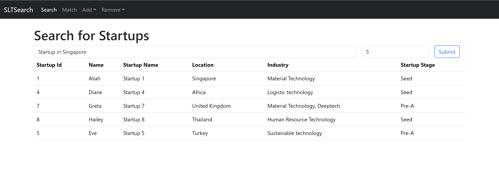

# SLTSearch
A react webapp that allows its users to search for startups and match investors with startups accordingly. 



## Architecture 


## Prerequisites
- [VS Code](https://code.visualstudio.com/Download)
- [Python](https://www.python.org/)
- [Node.js](https://nodejs.org/en)
- [Azure AI Search](https://learn.microsoft.com/en-us/azure/search/search-create-service-portal)
- [Azure Functions](https://learn.microsoft.com/en-us/azure/azure-functions/)

## Usage
### Setup Environment Variables
Once an Azure AI Search resource has been created, create a `.env` file containing the following: 
```
search_endpoint = "<YOUR-AZURE-AI-SEARCH-ENDPOINT>"
index_name = "<NAME-OF-INDEX>"
search_api_key="<NAME-OF-INDEX>"
openapi_key = "<YOUR-OPEN-AI-API-KEY>"
startupscsv = "<YOUR-CSV-FILE-PATH>"
```

To run locally, setup the `api/local.settings.json` file with the following values: 
```
    {
    "openaiKey":"<YOUR-OPEN-AI-API-KEY>",
    "searchEndpoint":"<YOUR-AZURE-AI-SEARCH-ENDPOINT>",
    "indexName":"<NAME-OF-INDEX>",
    "searchApiKey":"<NAME-OF-INDEX>"
  }

```

### Data source preparation
Create a `.csv` file of the startups following the format below: 
```
Name,StartupName,Location,StartupStage,Industry
Aliah,Startup 1,Singapore,Seed,Material Technology
```

### Index Creation
Use the [slt_startup_vector_search notebook](./slt_startup_vector_search.ipynb) to create the search index.

### Running the App
To use the webapp, run the following code inside the search-website folder:
```
npm install
npm run start
```

##    
This repository contains my solution for Microsoft Code; Without Barriers Hackathon 2024 -
She Loves Tech Problem Statement 2: Automate Investor-Startup Matching Solution. 

